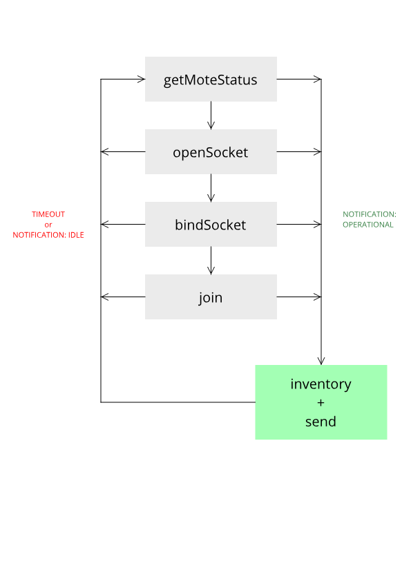

# rfid-firmware

Example firmware for RFID solution board.

## Initial Setup

*  Install and configure CrossCore Embedded Studio
*  Using ```CMSIS Pack Manager```, install ```ADuCM4x50``` packages:
    *  ```ARM.CMSIS```
    *  ```AnalogDevices.ADuCM4x50_DFP```
    *  ```AnalogDevices.ADuCM4x50_EZ_KIT_BSP```
    *  ```AnalogDevices.EV-COG-AD4050LZ__BSP```
*  Import the project into the existing workspace by using ```File``` | ```Import Projects from File System``` and selecting the repository root

You should now be able to build the project.

## Debugging Setup

*  Create a debug configuration in CrossCore Embedded Studio
*  Target processor: ```Analog Devices ADuCM4050```
*  Interface: ```ARM CMSIS-DAP compliant adapter```

## File / Folder Structure

*  ```src/adi_itk``` - platform specific code for Impinj RS2000
*  ```src/adi_sm_clib``` - platform specific code for SmartMesh Mote
*  ```src/led.*``` - debug led utility
*  ```src/timer.*``` - timer providing ms timing intervals
*  ```src/assert.*``` - debug assert
*  ```src/mote.*``` - smartmesh mote manager
*  ```src/rfid.*``` - rfid reader manager
*  ```lib/hashset``` - hashset implementation
*  ```lib/itk``` - impinj sdk
*  ```lib/sm_clib``` - smartmesh sdk
*  ```system``` - cces generated configuration code
*  ```RTE``` - cces generated device/component code

## Code Overview

In English, a high-level overview of what the code does:

### Initialisation

*  Initialise ADI components (CCES generated, Pin Mux etc.)
*  Initialise power driver and clock dividers
*  Initialise GPIO service
*  Initialise timer to provide 1ms intervals
*  Initialise debug LEDs
*  Initialise the memory for the hashset and iterator
*  Initialise RFID reader
    *  Reset the reader by toggling reset pin
    *  Run SDK setup method
    *  Register event handlers with SDK
    *  Open the serial port / connect to device
    *  Configure the reader region
    *  Configure the reader transmit power
    *  Optionally configure the reader to read TID memory bank
*  Initialise SmartMesh mote
    *  Reset the mote by toggling reset pin
    *  Configure CTS / RTS pins
    *  Run the SDK initialise method
    *  Read UART data in a loop until nothing left (mote sends status out on reset)

### Event Loop

See [App State Machine](#app-state-machine) diagram

## LED States

* SmartMesh Connecting
    *  ```RED Solid``` - Unknown
    *  ```RED Flashing``` - Idle
    *  ```RED Solid + AMBER Flashing``` - Searching
    *  ```AMBER Solid + Green Flashing``` - Negotiating
    *  ```GREEN Flashing``` - Connected
    *  ```GREEN Solid``` - Operational

* SmartMesh Connected
    *  ```GREEN Solid``` - Connected, pending RFID read
    *  ```GREEN Solid + RED Solid``` - Reading RFID tags
    *  ```GREEN Solid + AMBER Solid``` - Transmitting RFID tags across mesh

## SmartMesh State Machine



## App State Machine


